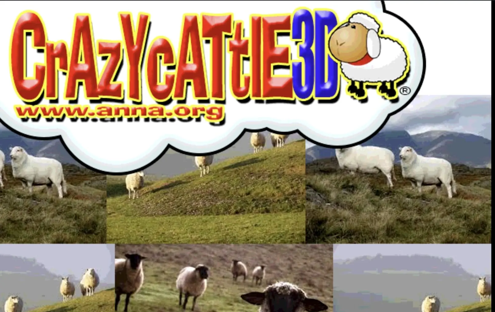

# Crazy Cattle 3D

<p align="center">
  
</p>

## 📖 Game Overview

Crazy Cattle 3D is an explosive sheep battle royale game where players control explosive sheep across three distinct global environments. The game features a unique physics engine creating a hilarious yet thrilling experience as you try to be the last sheep standing!

## 🎮 Key Features

- **Revolutionary Physics System**: Groundbreaking physics engine specifically designed for authentic sheep movement
- **Three Unique Environments**: Ireland, Iceland, and New Zealand maps, each with distinct strategic advantages
- **Explosive Gameplay**: Perfect your collision timing to send opponents flying off the map
- **Skill-Based Advancement**: Success comes from genuine player improvement, not unlocks or upgrades
- **Multi-Platform Support**: Play on desktop (Windows, Mac, Linux) and mobile devices (coming soon)

## 💻 Technology Stack

- **Frontend Framework**: React.js
- **Development Language**: TypeScript
- **Styling**: TailwindCSS
- **Routing**: Next.js
- **State Management**: React Context API
- **Responsive Design**: Optimized for both desktop and mobile devices

## 🚀 Installation Guide

### Prerequisites

- Node.js (v14.0.0 or above recommended)
- npm or yarn

### Installation Steps

1. Clone the repository

```bash
git clone https://github.com/yourusername/crazycattle3d.git
cd crazycattle3d
```

2. Install dependencies

```bash
npm install
# or using yarn
yarn install
```

3. Start the development server

```bash
npm run dev
# or using yarn
yarn dev
```

4. Visit http://localhost:3000 in your browser to play the game

## 📝 Game Controls

- **Movement**: Arrow keys or WASD
- **Charge**: Hold left click or spacebar
- **Jump**: Press E key
- **Special Moves**: Press Q for special attacks
- **Mobile Controls**: Touch controls available on mobile devices

## 📂 Project Structure

```
crazycattle3d/
├── components/           # React components
│   ├── common/           # Common components
│   ├── games/            # Game-related components
│   └── layout/           # Layout components
├── pages/                # Page components
├── public/               # Static assets
│   └── assets/
│       └── images/       # Image resources
├── styles/               # Style files
├── types/                # TypeScript type definitions
├── utils/                # Utility functions
├── .gitignore            # Git ignore file
├── package.json          # Project dependencies
├── tsconfig.json         # TypeScript configuration
└── README.md             # Project documentation
```

## 🔧 Future Development

- [ ] Multiplayer online battles
- [ ] New game environments
- [ ] Customizable sheep characters
- [ ] Mobile version release
- [ ] Achievement system
- [ ] Leaderboards

## 📄 License

This project is licensed under the [MIT License](LICENSE).

## 📞 Contact Information

- Email: contact@crazycattle3d.com
- Official Website: www.crazycattle3d.com
- Social Media: [Twitter](https://twitter.com/crazycattle3d) | [Discord](https://discord.gg/crazycattle3d)

---

Thank you for your interest in Crazy Cattle 3D!

